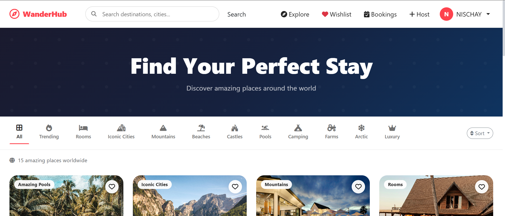
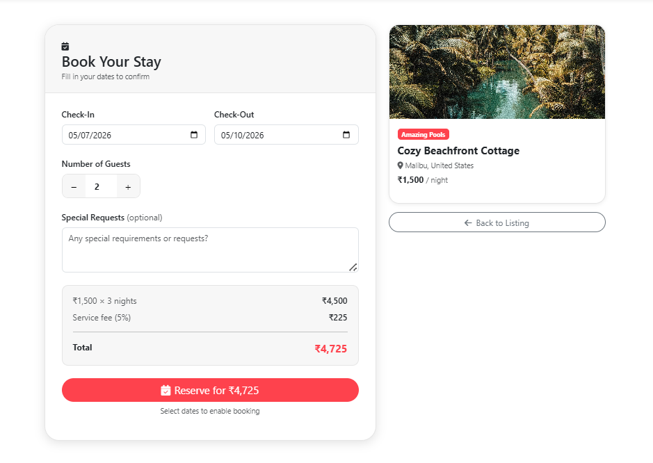
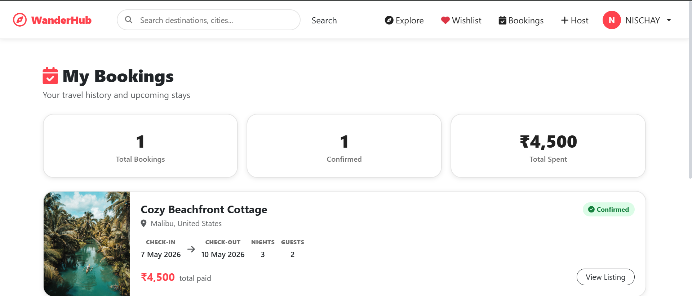
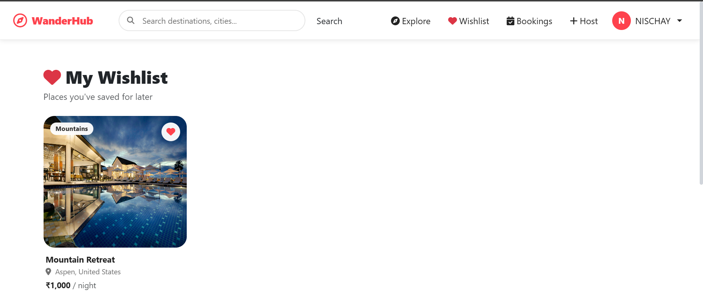
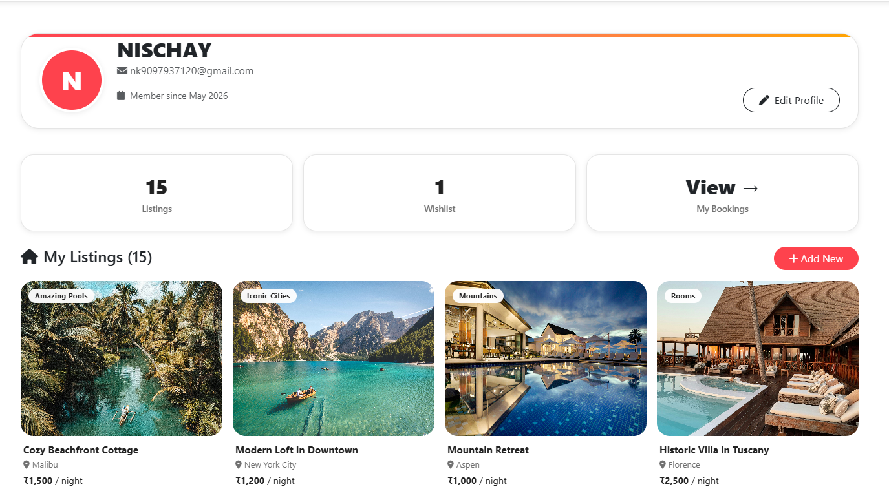
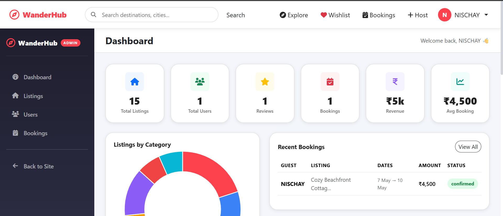

# 🌍 WanderHub

 A full-stack Airbnb-inspired travel accommodation platform where users can discover, list, book, and review stays from around the world.

🔗 **Live Demo:** [wanderhub-nv3i.onrender.com](https://wanderhub-nv3i.onrender.com/listings)

---

## 📸 Screenshots

### 🏠 Home Page


### 🏡 Listing Detail


### 📅 Book a Stay


### 📋 My Bookings


### ❤️ Wishlist


### 👤 User Profile


### 🛡️ Admin Dashboard


---

## ✨ Features

- 🔐 Register & Login with secure Passport.js authentication
- 🗂️ Browse stays across **11 categories** — Beaches, Mountains, Castles, Arctic, Luxury, Farms, Camping & more
- 🔍 Search listings by title, location or country
- 🔃 Sort by price (low/high) or newest
- 📷 Create & manage your own listings with Cloudinary image uploads
- 📅 Book stays with check-in/check-out dates & guest count
- 💰 Auto total price calculation (price × nights)
- 🚫 Date conflict detection — overlapping bookings are blocked
- ❌ Cancel bookings (only before check-in)
- ❤️ Wishlist — save & view your favourite listings
- ⭐ Star ratings + text reviews with average rating display
- 👤 User profile with avatar, bio, phone & listing stats
- 🛡️ Admin dashboard — manage all users, listings & bookings with live stats

---

## 🛠️ Tech Stack

**Frontend:** EJS, EJS-Mate, Bootstrap 5, CSS3, JavaScript, AOS

**Backend:** Node.js, Express.js, MVC Architecture

**Database:** MongoDB Atlas, Mongoose

**Auth:** Passport.js, passport-local-mongoose, express-session, connect-mongo

**Validation:** Joi

**File Uploads:** Multer + Cloudinary

---

## 📁 Project Structure

```
WANDERHUB/
├── controllers/        # Business logic (listing, booking, review, user, admin)
├── models/             # Mongoose schemas (Listing, Booking, Review, User)
├── routes/             # Express routers
├── views/              # EJS templates
│   ├── admin/
│   ├── bookings/
│   ├── listings/
│   ├── profile/
│   ├── users/
│   ├── wishlist/
│   └── includes/       # Navbar, footer, flash messages
├── public/             # CSS & JS assets
├── utils/              # ExpressError, wrapAsync
├── middlewares.js      # isLoggedIn, isOwner, isAdmin, validators
├── schema.js           # Joi validation schemas
├── cloudConfig.js      # Cloudinary + Multer config
└── app.js              # Main entry point
```

---

## 🚀 Run Locally

```bash
# Clone the repo
git clone https://github.com/your-username/wanderhub.git
cd wanderhub

# Install dependencies
npm install

# Seed the database (optional)
node init/index.js

# Start the server
node app.js
```

App runs at → `http://localhost:3000`


